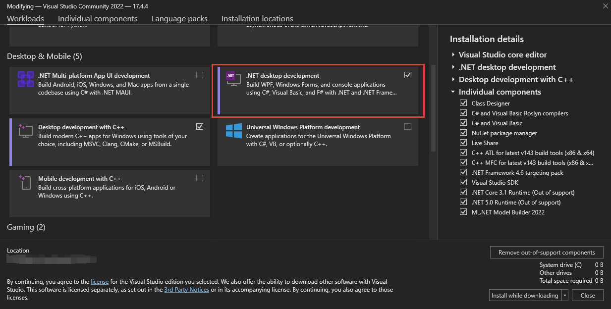
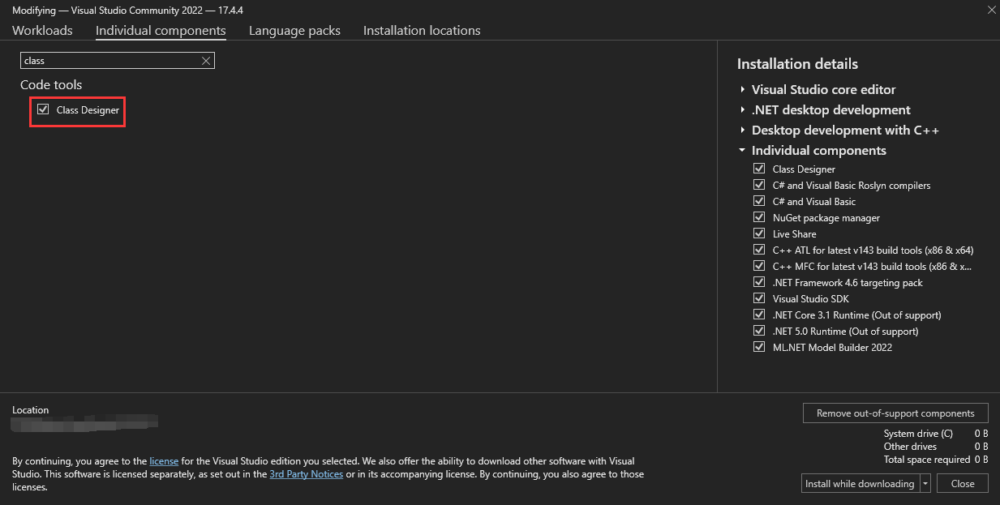
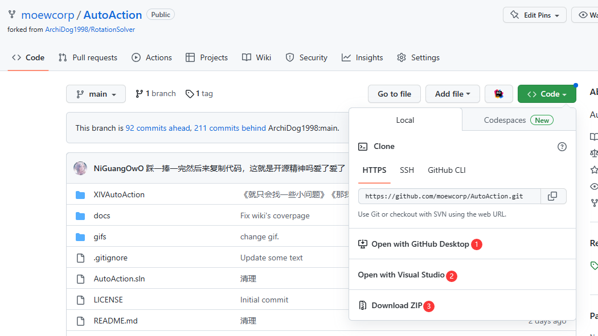
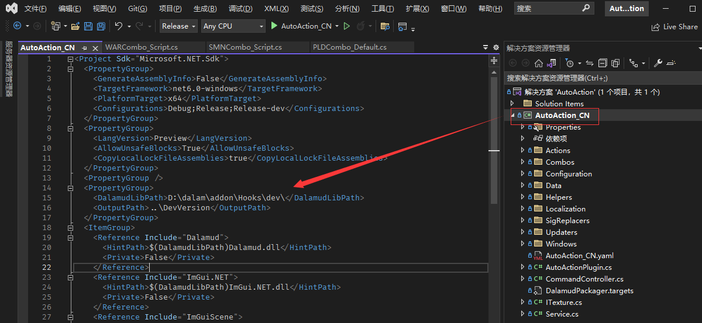
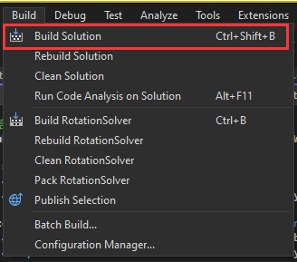
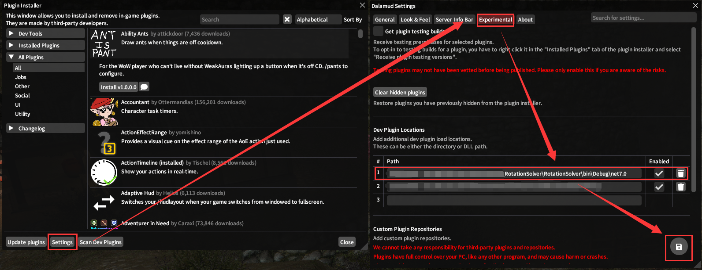

# 环境配置（接触过C#可以无视这部分）

## 安装Visual Studio

首先从官网下载VS，[Visual Studio](https://visualstudio.microsoft.com/)，确保安装了`.NET desktop development`模块和`Class Designer`组件，如下图所示。

## Fork Github Repo

Fork [Auto Action](https://github.com/moewcorp/AutoAction) 到你自己的仓库，并且使用你喜欢的方式下载代码到本地。

## 配置.csproj文件

在你的项目中，打开`AutoAction_CN.csproj`文件（在vs里双击，找到`<DalamudLibPath>`标签，把中间的内容改成本地Dalamud的对应位置（dev文件夹），如下图所示。

编译你自己的插件`dll`，默认输出路径是`AutoAction\DevPlugins\AutoAction_CN`，可以在csproj文件中的`<OutputPath>`标签中修改。

打开游戏，在如下图所示的位置添加你自己编译的插件路径。

NOTICE: 在加载自己编译的插件之前，你需要先禁用之前下载的AutoAction。

如果之前的配置正确，你应该可以在卫月插件中心左侧的`开发工具`中看到你自己编译的插件。